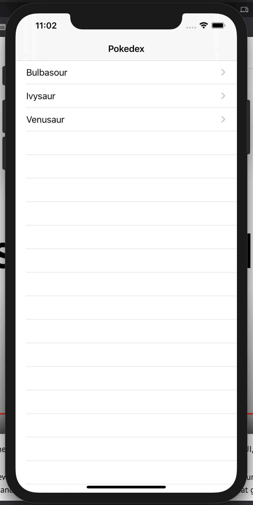
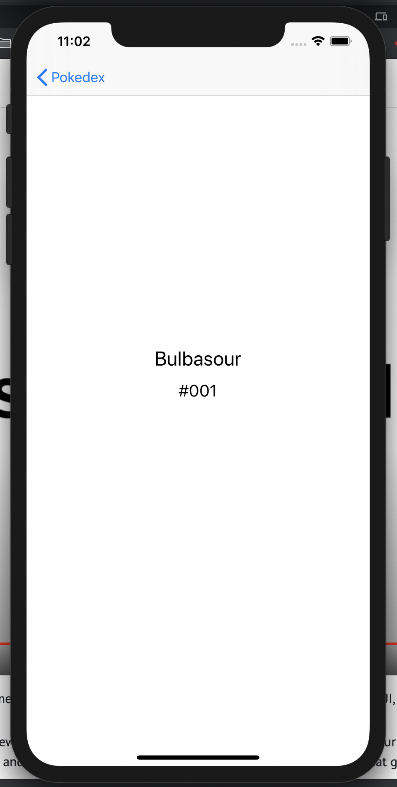

### iOS Track - Lesson 2

In this lesson we build on our Swift knowledge, by building a simple Pokemon Swift app with two views:
- a list view that lists all Pokemons
- a detail view that show details for each Pokemon (details being the name of the Pokemon and a number)

