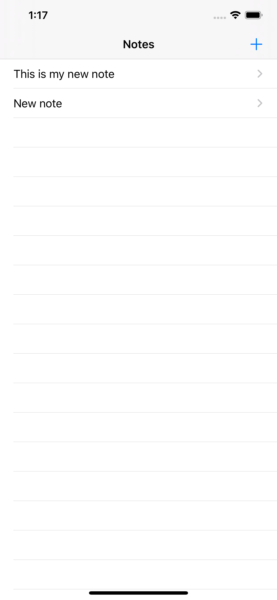
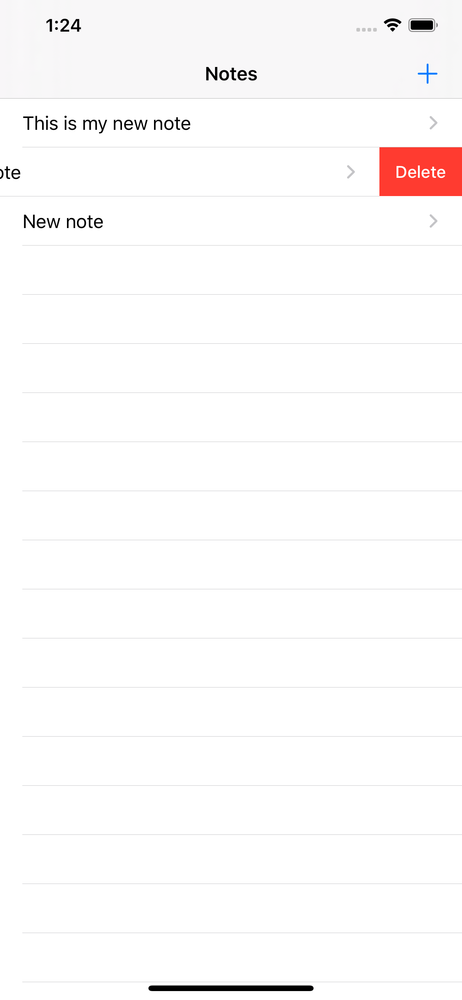

### iOS Track - Lesson 5

In this lesson we build another application - Notes

It allows the user to write and save notes.

For the purpose it uses a local SQLite 3 Database (which is just a file, saved on the user's device).

The code can be found in [Notes](Notes).

#### Assignment - Notes
[Assignment](https://cs50.harvard.edu/x/2020/tracks/mobile/ios/notes/#deleting-notes)

**Solution** - this solution build on the work already done, so check out [Notes](Notes).

